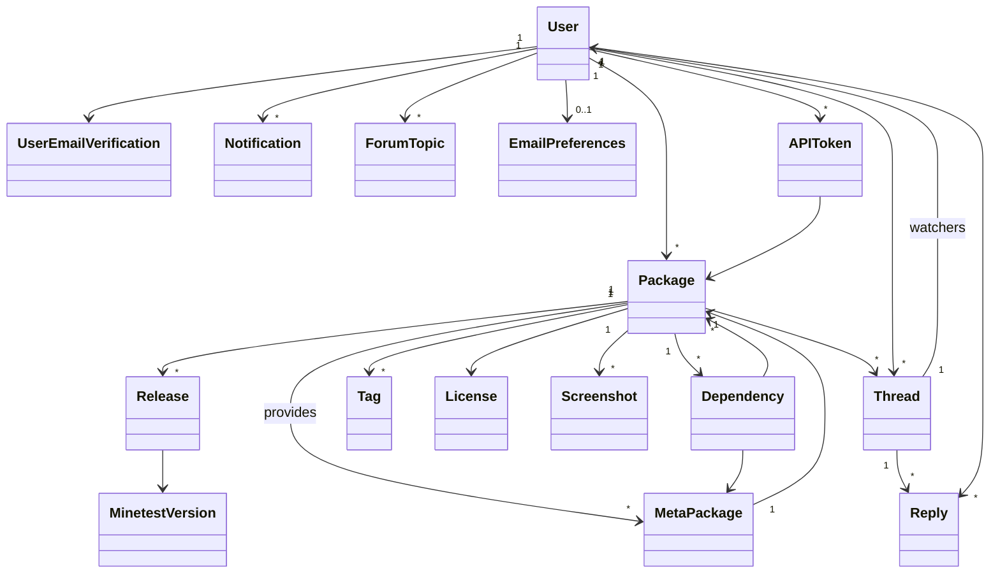

# Content Database
[](https://gitlab.com/minetest/contentdb/pipelines)

Content database for Minetest mods, games, and more.\
Developed by rubenwardy, license GPLv3.0+.

## Getting started (debug/dev)

Docker is the recommended way to develop and deploy ContentDB.

1. Install `docker` and `docker-compose`.

		sudo apt install docker-ce docker-compose

1. Copy `config.example.cfg` to `config.cfg`.

2. Fill out `config.cfg`
	1. Set `SQLALCHEMY_DATABASE_URI` = "postgres://contentdb:password@db:5432/contentdb"
	2. Optionally, set the MAIL settings.

3. (Optional) Set up GitHub integration
	1. Make a Github OAuth Client at <https://github.com/settings/developers>:
	2. Homepage URL - `http://localhost:5123/`
	3. Authorization callback URL - `http://localhost:5123/user/github/callback/`
	4. Put client id and client secret in `GITHUB_CLIENT_ID` and `GITHUB_CLIENT_SECRET` in config.cfg.

4. Create config.env:

		POSTGRES_USER=contentdb
		POSTGRES_PASSWORD=password
		POSTGRES_DB=contentdb
		FLASK_DEBUG=1

5. Start docker images:

		docker-compose up --build

6. Setup database:

		./utils/run_migrations.sh

8. (Optional) create initial data
	1. `./utils/bash.sh`
	2. Either `python setup.py -o` or `python setup.py -t`
      	1. `-o` creates just the admin, and static data like tags, and licenses.
      	2. `-t` will create test pacakges.

9.  View at <http://localhost:5123>.
    The admin username is `rubenwardy` and the password is `tuckfrump`.

In the future, starting CDB is as simple as:

	docker-compose up --build

To hot/live update CDB whilst it is running, use:

	./utils/reload.sh

This will only work with python code and templates, it won't update tasks or config.


## How-tos

```sh
# Hot/live reload (only works with FLASK_DEBUG=1)
./utils/reload.sh

# Cold update a running version of CDB with minimal downtime (production)
./utils/update.sh

# Enter docker
./utils/bash.sh

# Run migrations
./utils/run_migrations.sh

# Create new migration
./utils/create_migration.sh
```

## Database



