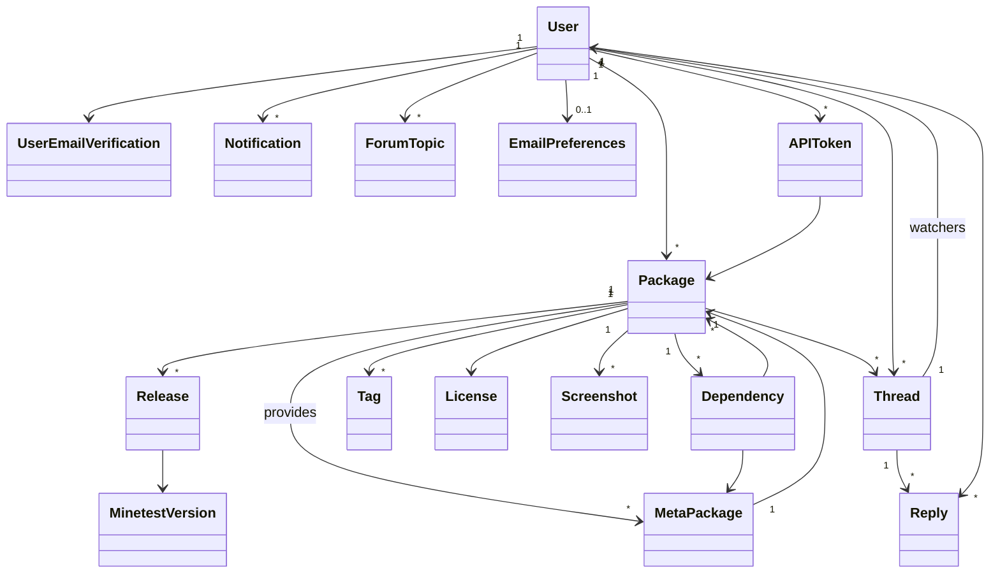

# Content Database

Content database for Minetest mods, games, and more.

Developed by rubenwardy, license GPLv3.0+.

## How-tos

Note: you should first read one of the guides on the [Github repo wiki](https://github.com/minetest/contentdb/wiki)

```sh
# Run celery worker
FLASK_CONFIG=../config.cfg celery -A app.tasks.celery worker

# if sqlite
python utils/setup.py -t
rm db.sqlite && python setup.py -t && FLASK_CONFIG=../config.cfg FLASK_APP=app/__init__.py flask db stamp head

# Create migration
FLASK_CONFIG=../config.cfg FLASK_APP=app/__init__.py flask db migrate
# Run migration
FLASK_CONFIG=../config.cfg FLASK_APP=app/__init__.py flask db upgrade

# Enter docker
docker exec -it contentdb_app_1 bash

# Hot/live reload (only works with FLASK_DEBUG=1)
./utils/reload.sh

# Cold update a running version of CDB with minimal downtime
./utils/update.sh
```

## Database



