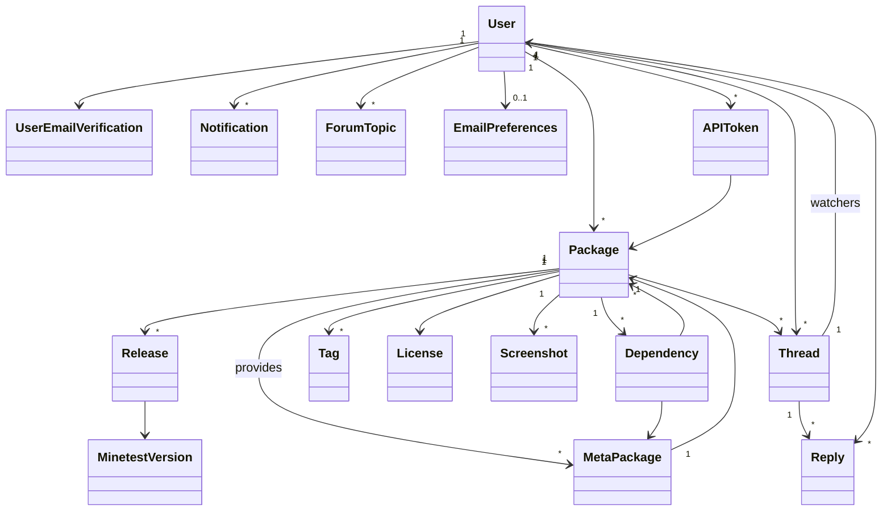

# ContentDB


A content database for Minetest mods, games, and more.\
Developed by rubenwardy, license AGPLv3.0+.

See [Getting Started](docs/getting_started.md) for setting up a development/prodiction environment.

See [Developer Intro](docs/dev_intro.md) for an overview of the code organisation.

## Credits

* `app/public/static/placeholder.png`: erlehmann, Warr1024. License: CC BY-SA 3.0

## How-tos

```sh
# Hot/live reload (only works with FLASK_DEBUG=1)
./utils/reload.sh

# Cold update a running version of CDB with minimal downtime (production)
./utils/update.sh

# Enter docker
./utils/bash.sh

# Run migrations
./utils/run_migrations.sh

# Create new migration
./utils/create_migration.sh

# Delete database
docker-compose down && sudo rm -rf data/db
```


### VSCode: Setting up Linting

* (optional) Install the [Docker extension](https://marketplace.visualstudio.com/items?itemName=ms-azuretools.vscode-docker)
* Install the [Python extension](https://marketplace.visualstudio.com/items?itemName=ms-python.python)
	* Click no to installing pylint (we don't want it to be installed outside a virtual env)
* Set up a virtual env
	* Replace `psycopg2` with `psycopg2_binary` in requirements.txt (because postgresql won't be installed on the system)
	* `python3 -m venv env`
	* Click yes to prompt to select virtual env for workspace
	* Click yes to any prompts about installing pylint
	* `source env/bin/activate`
	* `pip install -r requirements`
	* `pip install pylint` (if a prompt didn't appear)
	* Undo changes to requirements.txt

### VSCode: Material Icon Folder Designations

```json
"material-icon-theme.folders.associations": {
	"packages": "",
	"tasks": "",
	"api": "",
	"meta": "",
	"blueprints": "routes",
	"scss": "sass",
	"flatpages": "markdown",
	"data": "temp",
	"migrations": "archive",
	"textures": "images",
	"sounds": "audio"
}
```


## Database



